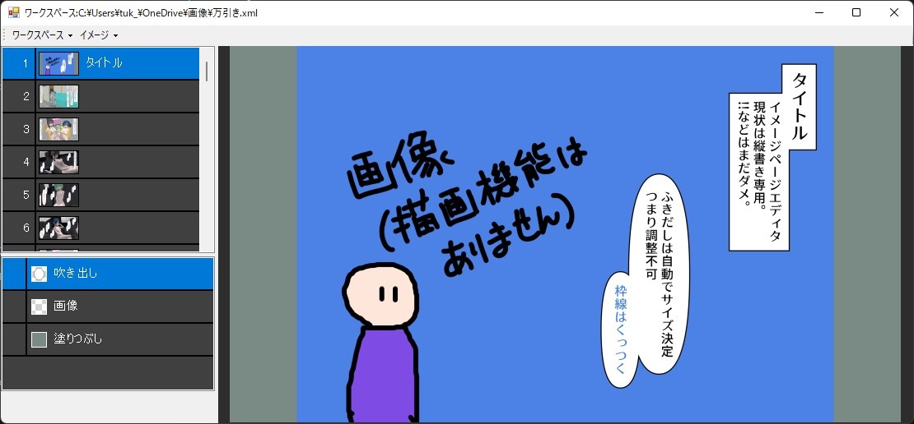

# ImagePageEditor

ImageSet的なもののページ管理・結果をExportするためのツール。  
サークル内使用のため開発しています。  

（ClipStudioのEXの機能のうちでこれだけ欲しかったので、じゃあ作ってみようかなと…）

## フォント

現在フォント変更には対応しておらず、デフォルトで[源暎ラテゴ v2](https://okoneya.jp/font/genei-latin.html)を使用します。
（フォント変更未実装）

## 画像サイズ

1280x720にダウンサイズして出力する予定のため、2560x1440のみ作成できます。  
（変更未実装）

## 最終的な出力

各ページをナンバリングしたファイルとして出力する機能を実装予定。  
（未実装）

## コード

超汚いのでちまちま直していきたいです…
